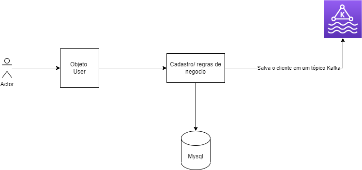

# user-api

# Objetivo

Criar uma API de cadastro de usuários para aperfersuar os estudos e as qualidades de desenvolvimento.

# Run

<h4 align="center"> 
	🚧 criar documentação de como executar o projeto  🚧 
</h4>

# Front

<h4 align="center"> 
	🚧 Criar uma pagina front-end e colocar link aqui  🚧 
</h4>

# Tecnologia

  - Spring
  - Kafka
  - Hexagonal
  - MYSQL
  - Swagger
  - "Firebird" (??? MIGRATIONS ???) 🚧
  
   
  
  - Teste Unitario
  - Teste de Integração
  - Pipeline de deploy (Jenkins)

  

# Fluxo

Cadastros de usuer

  - user:
      - nome
      - sobrenome
      - CPF
      - Data
      - Edereco:
          - cep
          - rua
          - bairro
          - estado
          - cidade
          - complemento

1. Ao cadastrar um usuario tem que postar no topico do kafka
2. Ao atualizar um usuario tem que postar no topico do kafka
3. Ao deltar um usuario tem que postar no topico do kafka

<h4 align="center"> 

      
</h4>

<h4 align="center"> 
	🚧 🚀 Em construção...  🚧 
</h4>
